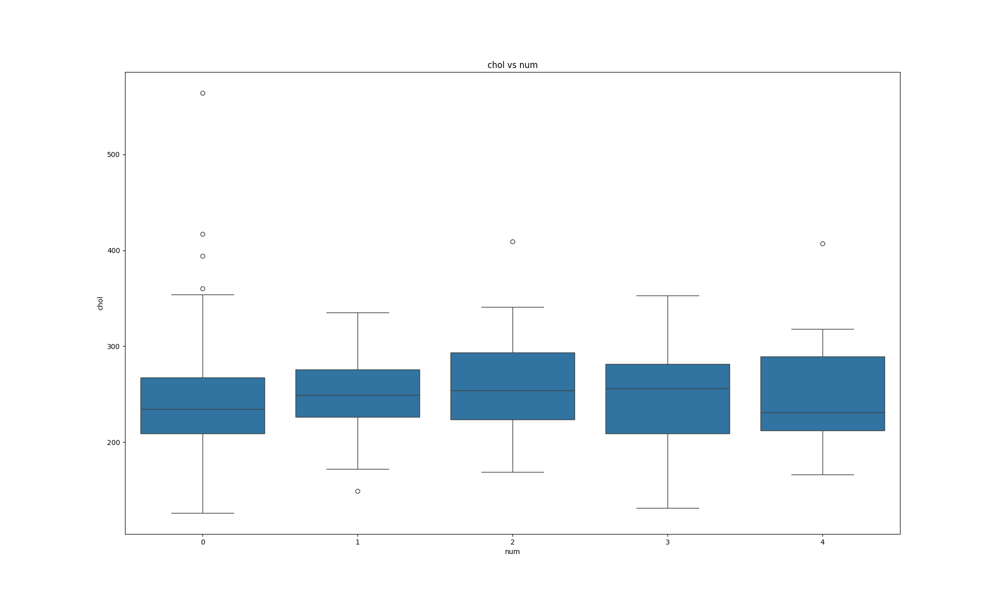

# Exploratory Data Analysis - Heart Disease Dataset

This document summarizes the EDA conducted on the UCI Heart Disease dataset, focusing on the relationship between features and the `num` variable, which encodes the presence and severity of heart disease.

## Dataset Overview

- **Samples**: 303
- **Features**: 13 (excluding the target `num`)
- **Target Variable**: `num` (0 = no disease, 1–4 = varying severity)
- **Missing Values**: Present in `ca` (4 missing) and `thal` (2 missing)

---

## Target Variable Distribution

- Majority class: `num = 0` (no disease)
- Class imbalance exists; higher severity classes have fewer instances.

---

## Missing Values

- Only `ca` and `thal` contain missing values.
- Should be imputed or removed before modeling.

### Missing Data Visualizations
- Bar chart: 
- Matrix: 

---

## Feature-wise Visualizations vs Heart Disease Stage (`num`)

### Age
  
- Older patients generally show higher heart disease severity.

### Sex
  
- Males (`sex=1`) more represented in higher severity stages.

### Chest Pain Type (`cp`)
  
- `cp=4` (asymptomatic) is most common among patients with disease.

### Resting Blood Pressure (`trestbps`)
  
- No strong trend; slight increase in medians with severity.

### Serum Cholesterol (`chol`)
  
- High variance across all stages; not a clear indicator.

### Fasting Blood Sugar (`fbs`)
  
- Mostly `fbs=0`. No meaningful variation in fasting blood sugar across disease stages, indicating limited predictive value.

### Resting ECG (`restecg`)
  
-  `restecg=1` becomes more common as heart disease severity increases. `restecg=2` does not show a clear trend.

### Max Heart Rate Achieved (`thalach`)
  
- Inversely correlated with disease severity.

### Exercise-Induced Angina (`exang`)
  
- Strong association: `exang=1` (yes) more common with `num > 0`.

### ST Depression (`oldpeak`)
  
- Clear upward trend with disease severity.

### Slope of ST Segment (`slope`)
  
- Flat (`2`) and downsloping (`3`) more frequent in disease.

### Number of Vessels Colored (`ca`)
  
- Strongly correlated with disease. Higher `ca` values associated with higher `num`.

### Thalassemia (`thal`)
  
- Fixed (6) and reversible (7) defects more frequent with disease.

---

## Correlation Matrix

**Top positively correlated with `num`:**
- `ca`: 0.52
- `thal`: 0.51
- `oldpeak`: 0.50
- `thalach`: -0.42 (inverse)
- `cp` : 0.41
- `exang`: 0.40

---

## PCA Analysis

Principal Component Analysis (PCA) was conducted to understand feature interactions and reduce dimensionality.

### Explained Variance
  
- PC1 explains ~23% of variance, PC2 ~12%, PC3 ~9.5%.
- First 5–6 PCs explain most of the variance and therefore dimensionality reduction is possible.

### Component Loadings

Key Insights:
- **PC1**: Influenced by  `oldpeak` and `thal`, and reversely by `thalarch`.
- **PC2**: Dominated by `sex`, `thal`, and reversely by `chol`, `tresecg` and `age`
- **PC5/PC6**: High influence from `restecg`, `fbs`, and `slope`.

###  About PCA?
- It reveals correlated variable groups.
- Helps with decorrelation and reducing redundancy.
- and aids in faster model training and visualization.

---

## Summary

- **Class imbalance** exists.
- Features most associated with disease: `ca`, `thal`, `oldpeak`, `cp`, `exang`.
- PCA confirms structure and redundancy in the data.
- Visualizations guide feature selection and preprocessing before modeling.

# Missing Value Handling Strategies

Different techniques can be used to handle missing values depending on the missingness pattern and feature importance:

### 1. Deletion
- **Pros**: Simple; preserves data integrity.
- **Cons**: Reduces sample size, It can introduce bias if data is not missing completely at random (MCAR).

**Use when**: Missingness is minimal and truly random.

### 2. Simple Imputation
- **Mean / Median (Numeric)**: Replaces missing values with a central value.
- **Mode (Categorical)**: Fills in with the most frequent category.

**Use when**: Feature is important and missingness is low to moderate.

### 3. Advanced Statistical Methods
- **Multiple Imputation**: Accounts for uncertainty by creating multiple datasets.
- **Model-based Imputation**: Uses machine learning (e.g., Random Forests) to predict missing values.

**Use when**: Feature is predictive but missingness is moderate to high.

### 4. Missingness Indicator Features
- Adds a new binary column to indicate whether the value was missing.

**Use when**: Missingness itself could be informative (e.g., `thal`, `ca`).

Since missing values are only a few in just 2 of the features, opting for either deletion or simple imputation plus indicator should be enough. For this project, simple imputation strategies were chosen but the code is flexible for advances imputation metrics: KNN.